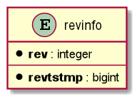

= Hibernate Envers Overview

== Features

* Easy to use JPA auditing extension.
* Historic data is stored in separate tables (possible to store in separate schema).
* Enables horizontal and vertical querying of historic data.
* No performance decrease on fetching data from primary tables.
* Envers uses Hibernate listeners (pre-insert, pre-update, ...).
* Auditing can be enabled per-entity or per-column.

<<<

== Internals

=== Database structure

Hibernate Envers utilizes a common table named `revinfo` which is shared between all auditing tables.



<<<

=== Auditing Strategies

* `org.hibernate.envers.strategy.DefaultAuditStrategy`

Default auditing strategy.

* `org.hibernate.envers.strategy.ValidityAuditStrategy`

Auditing strategy with strict revision time span.

```
For a new row that is persisted in an audit table, only the start-revision column of that row is set.

At the same time the end-revision field of the previous audit row is set to this revision.

Queries are retrieved using 'between start and end revision', instead of a subquery.

This has a few important consequences that need to be judged against against each other:
* Persisting audit information is a bit slower, because an extra row is updated
* Retrieving audit information is a lot faster
```

<<<

=== Inserting

For each insert Hibernate execute two additional inserts. One in `revinfo` table and another in `*_aud` table.

==== _DefaultAuditStrategy_
----
1.  insert into product (m_created_at, m_updated_at, m_version, name, price) values (?, ?, ?, ?, ?)
2.  select nextval ('hibernate_sequence')
3.  insert into revinfo (revtstmp, rev) values (?, ?)
4.  insert into product_aud (revtype, m_version, name, name_mod, price, price_mod, id, rev) values (?, ?, ?, ?, ?, ?, ?, ?)
----

==== _ValidityAuditStrategy_
----
1.  insert into product (m_created_at, m_updated_at, m_version, name, price) values (?, ?, ?, ?, ?)
2.  select nextval ('hibernate_sequence')
3.  insert into revinfo (revtstmp, rev) values (?, ?)
4.  insert into product_aud (revtype, m_version, name, name_mod, price, price_mod, id, rev) values (?, ?, ?, ?, ?, ?, ?, ?)
----

==== Entity with Relationships
----
1.  insert into customer (m_created_at, m_updated_at, m_version, address, first_name, last_name) values (?, ?, ?, ?, ?, ?)
2.  insert into customer_order (m_created_at, m_updated_at, m_version, customer_id, notes) values (?, ?, ?, ?, ?)
3.  insert into product (m_created_at, m_updated_at, m_version, name, price) values (?, ?, ?, ?, ?)
4.  insert into customer_order_product (customer_order_id, products_id) values (?, ?)

5.  select nextval ('hibernate_sequence')
6.  insert into revinfo (revtstmp, rev) values (?, ?)
7.  insert into customer_aud (revtype, m_version, address, address_mod, first_name, first_name_mod, last_name, last_name_mod, id, rev) values (?, ?, ?, ?, ?, ?, ?, ?, ?, ?)
8.  insert into customer_order_aud (revtype, m_version, notes, customer_id, id, rev) values (?, ?, ?, ?, ?, ?)
9.  insert into product_aud (revtype, m_version, name, name_mod, price, price_mod, id, rev) values (?, ?, ?, ?, ?, ?, ?, ?)
10.  insert into customer_order_product_aud (revtype, rev, customer_order_id, products_id) values (?, ?, ?, ?)

----

<<<

=== Updating

Comparing  entity update operation without relationship using both auditing strategies.

==== _DefaultAuditStrategy_
----
1.  update product set m_updated_at=?, m_version=?, name=?, price=? where id=? and m_version=?
2.  select nextval ('hibernate_sequence')
3.  insert into revinfo (revtstmp, rev) values (?, ?)
4.  insert into product_aud (revtype, m_version, name, name_mod, price, price_mod, id, rev) values (?, ?, ?, ?, ?, ?, ?, ?)
----

==== _ValidityAuditStrategy_
----
1.  update product set m_updated_at=?, m_version=?, name=?, price=? where id=? and m_version=?
2.  select nextval ('hibernate_sequence')
3.  insert into revinfo (revtstmp, rev) values (?, ?)
4.  insert into product_aud (revtype, revend, m_version, name, name_mod, price, price_mod, id, rev) values (?, ?, ?, ?, ?, ?, ?, ?, ?)
5.  update product_aud set revend=? where id=? and rev<> ? and revend is null
----

<<<

== Maven Dependency

https://mvnrepository.com/artifact/org.hibernate/hibernate-envers

----
<dependency>
    <groupId>org.hibernate</groupId>
    <artifactId>hibernate-envers</artifactId>
    <version>5.4.22.Final</version>
</dependency>

----

<<<

== Spring Integration

----
<dependency>
    <groupId>org.springframework.data</groupId>
    <artifactId>spring-data-envers</artifactId>
</dependency>
----

== Resources

Hibernate Envers
* https://hibernate.org/orm/envers

Spring Envers
* https://github.com/spring-projects/spring-data-envers

<<<

== Benchmark

Inserting *10000* customers performance with Hibernate Envers enabled.
JVM warmup with inserting 1000 customers in 9,263 seconds.
Customers were removed after each iteration.

[cols="1,3,3,5",options="footer,header"]
|===
|Iteration |Elapsed time (envers enabled) |Elapsed time (envers disabled) |Notes
|0.*
|9,263
|6,628
|28 % JVM warmup

|1.
|87,803
|51,028
|42%

|2.
|77,505
|53,274
|31%

|3.
|86,064
|60,49
|30%

|4.
|80,668
|57,053
|29%

|5.
|107,384
|66,262
|38%

|6.
|125,834
|78,897
|37%

|7.
|102,802
|85,851
|16%

|8.
|110,22
|79,042
|28%

|9.
|109,497
|76,579
|30%

|10.
|115,709
|76,072
|34%

|Mean
|100,3486
|68,4548
|32%
|===

 *Zero iteration is JVM warmup, done with 1000 inserts of customer in a database.
